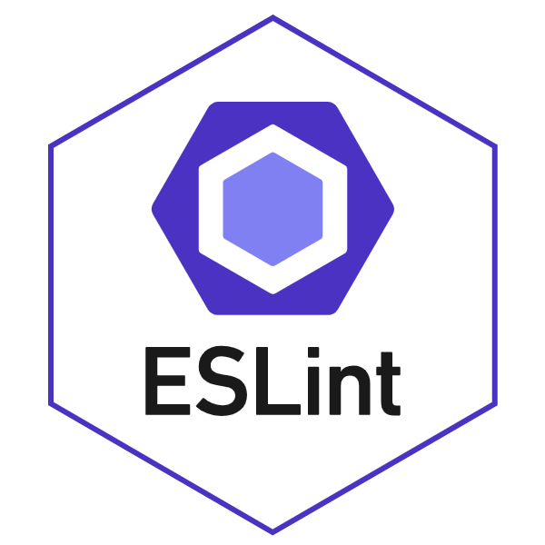
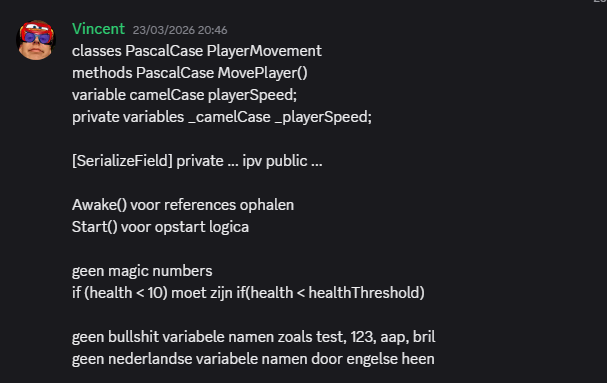
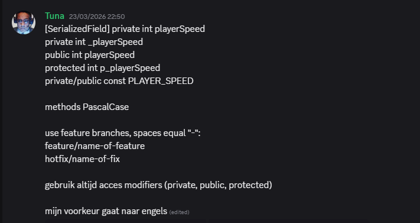
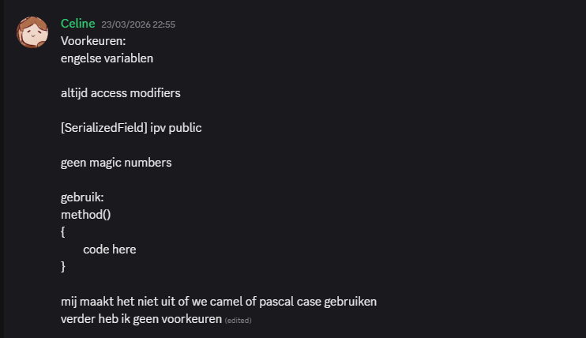
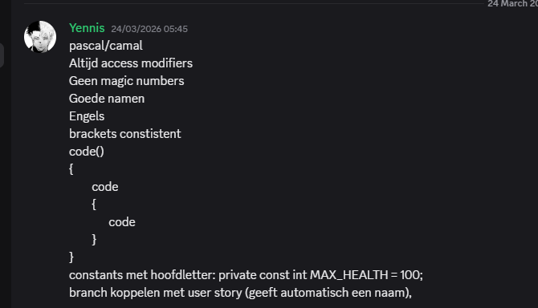
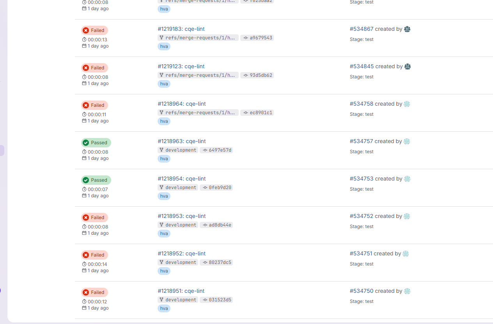
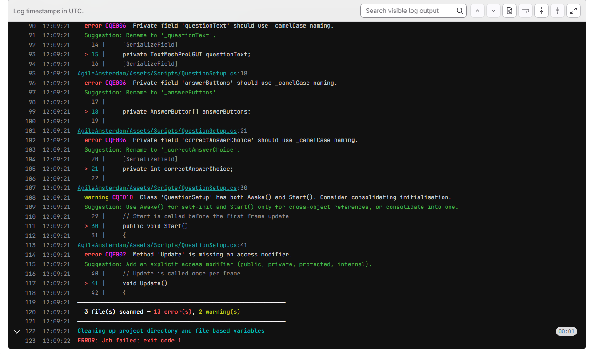
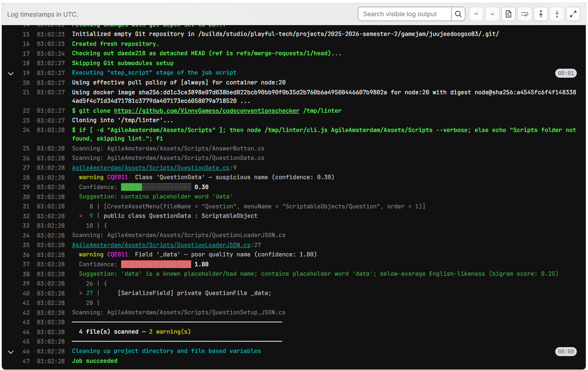

# Code Convention Checker – Documentatie

## 1. ANALYSE

Bij de start van het project werd al snel duidelijk dat codekwaliteit niet op een gestructureerde manier werd bewaakt. Er bestond geen formeel code review proces, en doordat iedereen eerder zelfstandig Unity-projecten had gemaakt, had iedereen zijn eigen schrijfstijl meegebracht. Dit leidde tot zichtbare inconsistenties in naamgeving, structuur en het gebruik van access modifiers, al bij de eerste gezamenlijke commits.

Het probleem is niet uniek voor dit team. Onderzoek binnen softwareontwikkeling toont aan dat inconsistente naamgevingsconventies een directe negatieve impact hebben op de leesbaarheid en onderhoudbaarheid van code [1]. Wanneer teamleden elkaars code moeten begrijpen of aanpassen, kost het extra cognitieve moeite als stijl per bestand verschilt. Dit is in de literatuur beschreven als een verhoogde cognitieve belasting, die de kans op fouten vergroot bij het lezen van onbekende code [2].

Concreet kwamen we de volgende problemen tegen: velden werden soms publiek gemaakt puur om ze zichtbaar te maken in de Unity Inspector, terwijl de correcte aanpak is om `[SerializeField]` te gebruiken op een privaat veld [6]. Klassenamen begonnen soms met een kleine letter, methoden hadden soms underscores in hun naam, en lokale variabelen waren soms geschreven in PascalCase terwijl dat voor methoden en klassen is bedoeld. Pas laat in het project, vlak voor een deadline, werden dit soort problemen opgemerkt en moesten ze handmatig worden gecorrigeerd.

Om dit probleem beter te begrijpen, is er gekeken naar hoe professionele softwareteams dit oplossen. De conclusie uit dat onderzoek is dat statische analyse, het automatisch doorlopen van broncode zonder die uit te voeren, de standaard aanpak is in de industrie. Tools als ESLint voor JavaScript, StyleCop voor C# en clang-format voor C en C++ zijn allemaal voorbeelden van tools die conventies automatisch afdwingen [3].



Het gemeenschappelijke principe achter al deze tools is dat ze de controle weg halen bij de individuele developer en centraliseren in een gedeeld systeem. Iedereen schrijft code, het systeem controleert die code tegen vaste afspraken, en de feedback is identiek voor ieder teamlid. Dit elimineert de afhankelijkheid van een individuele code reviewer die niet altijd beschikbaar is, of die niet consequent dezelfde dingen aanwijst.

Uit deze combinatie van eigen observaties en onderzoek naar bestaande tooling was de conclusie helder: het ontbrak aan een gedeelde standaard en een manier om die standaard automatisch en consequent af te dwingen. De oplossing moest dus twee dingen leveren: een set afgesproken regels, en een tool die die regels automatisch controleert op het moment dat code wordt ingediend.

---

## 2. ADVIES

Op basis van de analyse zijn eerst de conventies zelf vastgesteld. Omdat het project in Unity en C# geschreven is, zijn de Microsoft C# Coding Conventions gebruikt als uitgangspunt [4]. Die beschrijven onder andere dat klasse- en methodenamen PascalCase moeten zijn, dat lokale variabelen camelCase zijn, en dat private velden beginnen met een underscore gevolgd door camelCase. Dit zijn geen willekeurige keuzes: PascalCase voor types en methoden is in C# de geaccepteerde industriestandaard, en het consistent scheiden van private velden van lokale variabelen via het underscore-prefix maakt het onmiddellijk zichtbaar of iets een veld is of een lokale scope-variabele [1].

Naast de algemene C# conventies zijn er ook Unity-specifieke afspraken gemaakt. In Unity is het een veelgemaakte fout om velden public te declareren puur zodat ze zichtbaar zijn in de Inspector. Dit doorbreekt encapsulatie en exposeert interne toestand aan de buitenwereld zonder dat dat nodig is [2]. De correcte aanpak is een privaat veld met het `[SerializeField]` attribuut eroven, waardoor Unity het veld serialiseert zonder het publiek te maken [6]. Daarnaast is afgesproken dat initialisatiecode in `Awake()` thuishoort en niet verspreid mag worden over zowel `Awake()` als `Start()`, omdat de volgorde van uitvoering daartussen niet gegarandeerd is over meerdere objecten [7].






Het advies was vervolgens om de controle van deze afspraken zo vroeg mogelijk in het ontwikkelproces in te bouwen, een principe dat in de literatuur bekend staat als "shift-left testing" [3]. Wachten tot aan het einde van een sprint om code te reviewen kost veel meer tijd dan het direct afvangen bij een merge request. Als een developer een fout direct terugkrijgt op het moment dat zijn branch wordt ingediend, kan die het nog in zijn eigen context oplossen, zonder dat anderen ervan afhankelijk zijn of erdoor worden vertraagd.

De meest logische plek om deze controle te plaatsen is in een CI/CD pipeline op GitLab [8]. Elke keer dat iemand een merge request opent, start automatisch een pipeline die de checker uitvoert op de scripts van dat project. Als er errors worden gevonden, mislukt de pipeline en wordt de merge geblokkeerd. Omdat de checker in een aparte Git-repository leeft en alleen wordt gecloned tijdens de pipeline-run, is hij volledig losgekoppeld van het spelproject en herbruikbaar in andere projecten.





Het resultaat van dit advies is een systeem waarbij conventies niet meer afhankelijk zijn van een menselijke reviewer die al dan niet beschikbaar is, maar automatisch en consistent worden gecontroleerd op het moment dat code de hoofdbranch in wil.

---

## 3. ONTWERPEN

### Van JavaScript naar C#: de migratie

De eerste versie van de checker was een prototype geschreven in JavaScript. Die versie is volledig door een AI gegenereerd als een startpunt om snel iets werkends te hebben. Het gevolg was dat de code weliswaar draaide, maar niet door mij zelf was geschreven of volledig begrepen werd. De structuur was groter en complexer dan nodig, er zaten constructies in die ik niet direct kon doorgronden, en het aanpassen of uitbreiden ervan zou betekenen dat ik code zou moeten wijzigen waar ik geen eigenaarschap over voelde.

Daarom is de beslissing gemaakt om de tool volledig opnieuw te schrijven, ditmaal in C#. Niet als kopie van de JavaScript versie, maar als een herbouw waarbij elke regel code door mij zelf geschreven en begrepen is. C# is de taal die ik dagelijks gebruik in Unity-projecten en het meest vertrouwt mee ben, wat het de voor de hand liggende keuze maakt voor een tool die ik zelfstandig moet kunnen uitleggen, onderhouden en uitbreiden. De checker analyseert C# code maar was zelf in JavaScript geschreven. Dat betekent dat een developer die de checker wil begrijpen of aanpassen, twee talen moet kennen. Bovendien is C# de taal die het hele team dagelijks schrijft, wat betekent dat een C# implementatie veel laagdrempeliger is om aan bij te dragen.

Een tweede overweging was de CI/CD omgeving. Node.js is niet standaard beschikbaar in alle Docker images, terwijl Microsoft officiële .NET SDK images aanbiedt die direct werken met `dotnet run` [10]. Hierdoor is er geen eigen Dockerfile nodig en geen extra installatiestap. De pipeline kan direct de officiële `mcr.microsoft.com/dotnet/sdk:10.0` image gebruiken.

Een derde overweging speelde mee bij de taalcombinatie: een C# tool die C# code analyseert kan in principe gebruik maken van gedeelde kennis over de taal. Denk aan het herkennen van `access modifiers`, `attributes` en `lifecycle methods`, concepten die een C# developer direct herkent omdat hij er dagelijks mee werkt. De redenering was dat het schrijven en onderhouden van de analyselogica makkelijker is als de taal van de tool en de taal van de doelcode dezelfde zijn.

De architectuur van de tool is na de migratie gelijk gebleven: bestanden ophalen, commentaar verwijderen, declaraties extraheren, regels uitvoeren, en feedback formatteren. Elk van die stappen is in een apart bestand uitgewerkt: `Program.cs`, `Parser.cs`, `Rules.cs`, `Llm.cs` en `Reporter.cs`.

### Pipeline: .gitlab-ci.yml

```yaml
cqe-lint:
  image: mcr.microsoft.com/dotnet/sdk:10.0
  tags:
    - hva
  variables:
    LINTER_REPO: "https://github.com/VinnyGamess/codeconventionschecker"
    SCRIPTS_PATH: "AgileAmsterdam/Assets/Scripts"
    OLLAMA_MODEL: "tinyllama"
  cache:
    key: ollama-tinyllama
    paths:
      - .ollama/models
  script:
    - export OLLAMA_MODELS="$CI_PROJECT_DIR/.ollama/models"
    - apt-get update -qq && apt-get install -y -qq curl zstd
    - git clone "$LINTER_REPO" /tmp/linter
    - curl -fsSL https://ollama.com/install.sh | sh
    - ollama serve &
    - sleep 5
    - ollama pull "$OLLAMA_MODEL"
    - dotnet run --project /tmp/linter --configuration Release -- "$SCRIPTS_PATH" --verbose
  rules:
    - if: $CI_PIPELINE_SOURCE == "merge_request_event"
    - if: $CI_COMMIT_BRANCH == $CI_DEFAULT_BRANCH
  allow_failure: false
```

Dit bestand staat niet in de checker-repository maar in het spelproject. Het vertelt GitLab welke stappen uitgevoerd moeten worden telkens als iemand een merge request indient of naar de hoofdbranch pusht.

De keuze voor `mcr.microsoft.com/dotnet/sdk:10.0` als basis image maakt dat .NET 10 beschikbaar is zonder extra installatie. Ollama is het enige dat nog handmatig geïnstalleerd moet worden via het officiële installatiescript. Ollama is een tool waarmee grote taalmodellen lokaal gedraaid kunnen worden zonder afhankelijkheid van een externe API zoals die van OpenAI [11]. De reden om voor een lokale oplossing te kiezen in plaats van een cloud-API is tweeledig: er zijn geen kosten per verzoek, en de code die naar het model gestuurd wordt verlaat de pipeline-omgeving niet.

Het `OLLAMA_MODEL` variabele staat ingesteld op `tinyllama`, het kleinste bruikbare model met een omvang van circa 600 MB. Dit is een bewuste keuze. Grotere modellen geven kwalitatief betere resultaten, maar de pipeline-uitvoertijd neemt snel toe. Voor het herkennen van slechte namen, het enige waarvoor het model gebruikt wordt, is `tinyllama` voldoende. De modellen worden bovendien gecached via de GitLab cache-mechanisme, zodat het model bij opeenvolgende pipeline-runs niet opnieuw gedownload hoeft te worden.

De `allow_failure: false` instelling is bewust zo ingesteld. Als de checker errors vindt, mislukt de pipeline en wordt de merge geblokkeerd. Warnings blokkeren de merge niet maar zijn wel zichtbaar in de output. Dit onderscheid is ontworpen op basis van het principe dat stijlkwesties die de leesbaarheid ernstig schaden worden behandeld als blokkerende fouten, terwijl suggesties ter verbetering als niet-blokkerende warnings worden gerapporteerd [3].

### Program.cs — Het startpunt

`Program.cs` is het entry point van de tool. Het verwerkt de commandoregel-argumenten, bepaalt welke bestanden geanalyseerd worden, en stuurt de resultaten door naar de reporter.

```
dotnet run -- pad/naar/scripts --verbose --no-llm
```

Het eerste argument dat niet begint met `--` wordt geïnterpreteerd als het pad. Als dat pad een bestand is, wordt alleen dat bestand geanalyseerd. Is het een map, dan worden alle `.cs` bestanden daarin recursief opgehaald en gesorteerd op naam. Het ophalen van bestanden is bewust compact gehouden:

```csharp
var files = File.Exists(path)
    ? new[] { path }
    : Directory.GetFiles(path, "*.cs", SearchOption.AllDirectories).OrderBy(f => f).ToArray();
```

De vlag `--no-llm` schakelt de AI-naamgevingscheck uit. Dit is nuttig tijdens lokaal testen, wanneer Ollama niet actief is. De `--verbose` vlag laat de suggestie per violation zien naast het bericht zelf.

De exitcode is functioneel onderdeel van het ontwerp: het programma geeft exitcode `1` terug als er een of meer errors zijn gevonden, en `0` als alles in orde is. GitLab interpreteert exitcode `1` als een mislukte pipeline-stap, waardoor de merge automatisch geblokkeerd wordt zonder dat er extra configuratie nodig is in het pipeline-bestand [8].

### Parser.cs — De code-analyser

De parser is verantwoordelijk voor het extraheren van alle declaraties uit een C# bronbestand. Het resultaat is een lijst van `Declaration` objecten die elk één gevonden structuur beschrijven: een klasse, methode, veld of lokale variabele.

#### Wat is een reguliere expressie?

Een reguliere expressie (afgekort *regex*) is een patroon waarmee je tekst doorzoekt. Je beschrijft in een speciale syntax *hoe een stuk tekst eruit moet zien*, en de regex-motor doorloopt een string om te kijken of er een stukje tekst is dat aan dat patroon voldoet.

Een eenvoudig voorbeeld: het patroon `\d+` matcht één of meer cijfers. Als je dat patroon loslaat op de tekst `"speler heeft 42 punten"`, vindt het `42`. Het patroon `\w+` matcht één of meer letters, cijfers of underscores — dus woorden en identifiers.

In de code wordt regex gebruikt om dingen als dit te herkennen:

```
public class PlayerController
```

Het patroon voor types ziet er zo uit:

```regex
^((?:(?:public|private|...|partial)\s+)*)(class|struct|interface|enum|record)\s+(\w+)
```

Dit patroon zegt letterlijk: begin van de regel (`^`), gevolgd door nul of meer modifier-woorden zoals `public` of `abstract`, gevolgd door één van de type-sleutelwoorden (`class`, `struct` enzovoort), gevolgd door een spatie, gevolgd door de naam (een woord: `\w+`). De haakjes `(...)` zijn *groepen* — alles wat daarbinnen matcht, wordt afzonderlijk opgeslagen. Na de match lees je dus: groep 1 = `"public "`, groep 2 = `"class"`, groep 3 = `"PlayerController"`.

Zo werkt het voor methoden en velden ook, met eigen patronen. Dat maakt het mogelijk om in één stap zowel het *soort* declaratie als de *naam* en de *modifiers* te herkennen, zonder de regel zelf handmatig te hoeven splitsen op spaties of woorden.

#### De keuze voor reguliere expressies

Bij het ontwerpen van de parser bestond de keuze tussen twee aanpakken: een volledige syntaxparser zoals Roslyn, de officiële C# compiler-API, of een aanpak gebaseerd op reguliere expressies. Roslyn geeft een volledige, semantisch rijke representatie van de code en herkent elk construct van de taal foutloos [5]. Reguliere expressies zijn echter veel eenvoudiger te implementeren en te begrijpen voor iemand die de code voor het eerst leest.

Voor het doel van deze tool is semantische rijkheid niet nodig. Er hoeft niet te worden vastgesteld of een type bestaat, of welke namespace iets in zit, of wat de return type van een generieke methode is. Er moet alleen worden vastgesteld hoe iets heet, wat zijn access modifier is, en of het een klasse, methode of veld is. Dat zijn structurele eigenschappen die direct zichtbaar zijn in de tekst van de code, wat reguliere expressies geschikt maakt [9].

De eerste versie in JavaScript gebruikte dezelfde aanpak met vergelijkbare patronen. De migratie naar C# behield deze architectuurkeuze. De regex-patronen zijn daarna uitgebreid om meer edge cases te dekken, zoals generieke types (`List<T>`), properties met getter/setter, en constructors die hetzelfde heten als hun klasse.

#### Commentaar verwijderen

Voordat de parser begint met zoeken verwijdert hij alle commentaar en string-literals via één Regex die meerdere alternatieven combineert:

```
@"@""[^""]*(?:""""[^""]*)*""|""(?:[^""\\]|\\.)*""|'(?:[^'\\]|\\.)*'|//[^\n]*|/\*.*?\*/"
```

Dit patroon matcht verbatim strings (`@"..."`), gewone strings (`"..."`), karakterliterals (`'...'`), regelcommentaar (`// ...`) en blokcommentaar (`/* ... */`). Strings en karakterliterals worden teruggegeven onveranderd zodat de regelnummers intact blijven, terwijl commentaar wordt vervangen door een even groot aantal newlines. Dat laatste is essentieel: als commentaar simpelweg zou worden verwijderd, zouden alle regelnummers na een blokcommentaar verkeerd zijn [9].

**Waarom is dit überhaupt nodig?**

Stel dat iemand dit in de code heeft staan:

```csharp
// public class OudeKlasse
// private float speed;
```

Zonder commentaar strippen zou de parser denken dat er een klasse `OudeKlasse` en een veld `speed` in de code zitten. Dat zijn valse meldingen op code die helemaal niet actief is.

Hetzelfde geldt voor strings:

```csharp
string uitleg = "gebruik public class Foo als voorbeeld";
```

De tekst `public class Foo` staat hier in een string-literal — het is data, geen code. Zonder de string eerst weg te halen zou de parser ten onrechte een klasse `Foo` herkennen.

Door commentaar en strings als eerste stap te verwijderen, ziet de parser alleen de daadwerkelijke C# structuur. Regelnummers blijven kloppen omdat commentaar wordt vervangen door evenveel lege regels — de regels schuiven dus niet op.

#### Scope-gebaseerd scannen

De parser leest het bestand regel voor regel en houdt bij in welke scope elke regel valt via een stack. Elke keer dat er een `{` wordt gevonden, wordt een scope op de stack geplaatst. Bij een `}` wordt de bovenste scope er weer afgehaald. De naam van de scope (`"namespace"`, `"type"`, `"method"`, `"block"`) vertelt de parser wat voor declaraties er op die plek te verwachten zijn.

Dit wordt afgehandeld via een `switch` op de huidige scope:

```csharp
switch (scope)
{
    case "global": case "namespace": // zoek naar klassen, structs, interfaces
    case "type":                     // zoek naar methoden en velden
    case "method": case "block":     // zoek naar lokale variabelen
}
```

Binnen de `"type"` case wordt geprobeerd eerst een methode te herkennen, en als dat mislukt een veld. Constructors worden uitgefilterd door te controleren of de methodenaam gelijk is aan de naam van de omsluitende klasse. De naam van die omsluitende klasse wordt bijgehouden in een aparte `classStack`, zodat elke gevonden declaratie ook de naam van zijn parent-klasse meekrijgt als `Parent` property.

**Waarom is de scope-stack nodig?**

Dezelfde regex die een methode herkent — `naam(` — zou ook een aanroep als `GetComponent<T>(` herkennen als die bovenaan een .cs-bestand stond. Het verschil tussen een declaratie en een aanroep is niet zichtbaar in één regel tekst: het is context. Door bij te houden waar je je bevindt in de code, weet de parser op welke plekken declaraties *kunnen* voorkomen en op welke plekken alleen statements staan.

Een concreet voorbeeld met een klein C# bestand:

```csharp
namespace GameLogic               // regel 1
{                                 // regel 2  → push "namespace"
    public class PlayerController // regel 3  → Declaration gevonden: class "PlayerController"
    {                             // regel 4  → push "type", classStack = ["PlayerController"]
        private float _speed;     // regel 5  → Declaration gevonden: field "_speed"
        public void Move()        // regel 6  → Declaration gevonden: method "Move"
        {                         // regel 7  → push "method"
            float step = 0.1f;    // regel 8  → Declaration gevonden: variable "step"
        }                         // regel 9  → pop "method"
    }                             // regel 10 → pop "type", classStack = []
}                                 // regel 11 → pop "namespace"
```

Op regel 5 staat de scope bovenaan de stack op `"type"` — de parser weet dus dat het een veld of methode moet zijn, en `MatchField` herkent `_speed`. Op regel 8 staat de scope op `"method"` — daar mogen alleen lokale variabelen staan, en `MatchVariable` herkent `step`. Als de scope-stack er niet was, zou de parser op regel 8 óók proberen een methode te vinden, en `step` zou als methodenaam worden gemeld.

#### De Declaration klasse

Elk gevonden element wordt opgeslagen als een `Declaration` met zes eigenschappen. `Kind` beschrijft wat het is: `"class"`, `"struct"`, `"interface"`, `"enum"`, `"record"`, `"method"`, `"field"` of `"variable"`. `Name` is de identifier zoals die in de code staat. `Modifiers` is een lijst van sleutelwoorden die voor de declaratie staan, zoals `public`, `private`, `static` of `readonly`. `Attributes` bevat eventuele C# attributen die op de vorige regel stonden, zoals `SerializeField`. `Line` is het regelnummer in het originele bestand, en `Parent` is de naam van de klasse waar de declaratie in zit.

**Waarom een klasse en niet gewoon tekst doorgeven?**

Je zou na het parsen elke gevonden naam als losse string kunnen bijhouden — maar dan ben je direct het bijbehorende regelnummer kwijt, je weet niet meer of het een methode of een veld was, en je weet niet welke modifiers erop stonden. Zodra je ook maar één extra stuk informatie nodig hebt, heb je een structuur nodig.

Door alles in één `Declaration` object te stoppen, kan elke regel-check in `Rules.cs` precies datgene opvragen wat hij nodig heeft zonder opnieuw door de broncode te hoeven zoeken. `CheckPrivateFieldNames` kijkt naar `d.Kind == "field"` en `d.Modifiers.Contains("private")`. `CheckSerializeField` kijkt naar `d.Attributes.Contains("SerializeField")`. Zonder de klasse zou elke check opnieuw regex moeten draaien op de ruwe code.

Een concrete `Declaration` voor deze C# regel:

```csharp
[SerializeField] private float _jumpHeight = 5f;
```

ziet er intern zo uit:

| Eigenschap | Waarde |
|---|---|
| `Kind` | `"field"` |
| `Name` | `"_jumpHeight"` |
| `Modifiers` | `["private"]` |
| `Attributes` | `["SerializeField"]` |
| `Line` | `12` |
| `Parent` | `"PlayerController"` |

Elke check krijgt een lijst van dit soort objecten. De checks hoeven de broncode nooit opnieuw te lezen.

### Rules.cs — De controlelogica

`Rules.cs` bevat alle controleregels en de twee dataklassen `Violation` en de helpers die daarvoor nodig zijn. De `Run` methode voert alle checks sequentieel uit, verzamelt de violations, en sorteert ze op regelnummer voordat ze worden teruggegeven. De sortering zorgt ervoor dat de output in de terminal in dezelfde volgorde staat als de code in het bestand.

**Waarom worden violations verzameld in een lijst in plaats van direct geprint?**

Elke check-methode geeft een lijst van `Violation` objecten terug in plaats van de fouten direct naar de console te schrijven. Dit lijkt op het eerste gezicht een omweg, maar het heeft een duidelijke reden: als iedere check zelf zou printen, zou de output in willekeurige volgorde verschijnen — CQE001 voor regel 50, dan CQE005 voor regel 3, dan CQE003 voor regel 12. Dat maakt de output moeilijk te lezen.

Door alle violations eerst te verzamelen kan de `Run` methode ze sorteren op regelnummer. De developer ziet de fouten dan precies in de volgorde van zijn bestand, van boven naar beneden, net zoals een compiler dat doet. Bovendien kan de `Reporter` op die manier kleuren, formattering en de `--verbose` vlag centraal afhandelen zonder dat elke check daarvoor code moet bevatten.

**Waarom is elke check een aparte methode?**

In de eerste versie zou je in theorie één grote loop kunnen hebben die tegelijk op PascalCase, access modifiers en magic numbers controleert. Dat is sneller te schrijven, maar zodra je een regel wil aanpassen, uitbreiden of debuggen, moet je door een groot blok logica. Door elke check te scheiden in zijn eigen methode — `CheckTypeNames`, `CheckMagicNumbers`, `CheckAwakeVsStart` — is het toevoegen van een nieuwe regel simpelweg een nieuwe methode schrijven en die aanroepen in `Run()`. De rest van de code hoeft niet aangeraakt te worden.

#### Overzicht van alle regels

| Code | Omschrijving | Ernst |
|------|-------------|-------|
| CQE001 | Publiek veld gevonden — gebruik een property | error |
| CQE002 | Geen access modifier (`public`/`private`) | error |
| CQE003 | Klasse/struct/interface naam is niet PascalCase | error |
| CQE004 | Methode naam is niet PascalCase | error |
| CQE005 | Variabele naam is niet camelCase | error |
| CQE006 | Privaat veld volgt niet het `_camelCase` patroon | error |
| CQE008 | Magic number gevonden (los getal zonder naam) | warning |
| CQE009 | Publiek veld dat beter `[SerializeField] private` zou zijn | warning |
| CQE010 | Zowel `Awake()` en `Start()` aanwezig, of geen van beide | warning |
| CQE011 | Naam klinkt onduidelijk of niet-Engels (via AI) | warning |

#### Naamgevingsregels (CQE001 t/m CQE006)

De naamgevingsregels zijn gebaseerd op de officiële Microsoft C# Coding Conventions [4]. PascalCase voor types en methoden, camelCase voor lokale variabelen, en `_camelCase` voor private instantievelden. De implementatie controleert uitsluitend op het eerste teken en de aanwezigheid van underscores, wat een bewust simpele benadering is. Dit dekt de meeste gevallen zonder dat er complexe tokenisatie nodig is.

De check op publieke velden (CQE001) maakt een uitzondering voor `const` en voor `static readonly` combinaties. Constanten zijn conventioneel publiek in C# en stellen geen encapsulatie-probleem omdat hun waarde nooit verandert. `static readonly` velden gedragen zich functioneel als constanten en worden in de C# conventie op dezelfde manier behandeld [4].

De controle op access modifiers (CQE002) slaat lokale variabelen expliciet over, omdat die per definitie geen access modifier hebben in C#. Alle andere declaraties, klassen, methoden en velden, moeten expliciet een modifier hebben. Het impliciet private-zijn van een methode zonder modifier is weliswaar geldig C#, maar vermindert de leesbaarheid doordat de intentie niet direct duidelijk is [1].

**Waarom zijn CQE001 en CQE009 allebei nodig als ze allebei op publieke velden letten?**

Ze controleren hetzelfde feit — het veld is publiek — maar om verschillende redenen. CQE001 zegt: *een publiek veld zou een property moeten zijn*, want in C# is het de conventie om data te ontsluiten via properties die je kunt voorzien van validatie, readonly-gedrag et cetera. CQE009 zegt: *dit publieke veld is waarschijnlijk alleen publiek gemaakt zodat Unity het serialiseert*, wat een Unity-specifiek probleem is dat los staat van de algemene property-conventie. In de praktijk worden beide violations bij hetzelfde veld gemeld, wat de developer twee concrete redenen geeft om het aan te passen.

Het gebruik van C# pattern matching maakt de type-check voor CQE003 compact leesbaar:

```csharp
if (d.Kind is not ("class" or "struct" or "interface" or "enum" or "record")) continue;
```

#### Magic numbers (CQE008)

Een magic number is een numerieke literal die direct in de code staat zonder dat de betekenis ervan duidelijk is uit de context. `transform.position.y > 45.0f` is een voorbeeld: waarom 45? Wat stelt dat getal voor? De correcte aanpak is het definiëren van een benoemde constante [2]:

```csharp
const float MaxHeight = 45.0f;
if (transform.position.y > MaxHeight)
```

**Hoe weet de check dat een getal een magic number is en geen onderdeel van een declaratie?**

De regex `\b\d+(?:\.\d+)?[fFdDmMuUlL]?\b` vindt alle numerieke literals in een regel. Maar diezelfde regex zou ook dit vlaggen:

```csharp
private const float Gravity = 9.81f;
```

Terwijl dat juist de *correcte* definitie van een constante is. De check omzeilt dit door regels over te slaan die een declaratiewoord bevatten — `public`, `private`, `protected`, `internal`, `readonly`, `static` of `const`. Op zo'n regel staat waarschijnlijk een declaratie, en de waarde die eraan wordt toegekend is de definitie, niet het gebruik.

Hetzelfde geldt voor enum-definities:

```csharp
enum Richting { Noord = 0, Oost = 1, Zuid = 2, West = 3 }
```

De getallen `0`, `1`, `2`, `3` zijn daar enum-waarden, geen magic numbers. Een aparte regex herkent enum-achtige regels en slaat ze over.

De getallen `0`, `1` en `2` worden als uitzondering nooit gemeld, omdat die in de meeste contexten vanzelfsprekend zijn — denk aan `for (int i = 0; i < count; i++)` of `transform.localScale = Vector3.one * 2`.

#### Unity-specifieke regels (CQE009 en CQE010)

CQE009 controleert op publieke velden die in de Unity Inspector zichtbaar zijn. In Unity serialiseert de engine publieke velden automatisch, en in de vroege Unity-leerjaren is het een veelgemaakte gewoonte om velden public te maken puur om ze in de Inspector te kunnen instellen [6]. Dit is echter een schending van encapsulatie: andere scripts kunnen het veld dan ook lezen en schrijven. De correcte aanpak is `[SerializeField] private`, waardoor Unity het veld serialiseert maar de toegang vanuit code beperkt blijft.

CQE010 controleert op de aanwezigheid van zowel `Awake()` als `Start()` in dezelfde klasse. Unity roept `Awake()` aan voordat objecten met elkaar communiceren, en `Start()` daarna, maar de volgorde van uitvoering over meerdere objecten heen is niet gedefinieerd [7]. Het verspreiden van initialisatiecode over beide methoden maakt het moeilijk te redeneren over wat er wanneer is uitgevoerd. De check gebruikt een tuple switch die de drie relevante combinaties van booleans leesbaar op een rij zet:

```csharp
switch (hasAwake, hasStart, hasLifecycle)
{
    case (true, true, _):      // beide aanwezig — waarschuwing
    case (false, false, true): // lifecycle zonder initialisatie — waarschuwing
}
```

### Llm.cs — AI-gebaseerde naamgevingsanalyse

Reguliere expressies kunnen controleren of een naam aan een patroon voldoet, maar niet of de naam ook inhoudelijk deugt. `PlayerController` is PascalCase en zou alle patrooncontroles doorstaan, terwijl `Ding`, `TestScript` of `Speler` dat ook zouden. Een AI-model kan de inhoudelijke kwaliteit beoordelen: is de naam beschrijvend, is het Engels, heeft het een duidelijke betekenis in de context van het soort declaratie?

De aanleiding voor het toevoegen van de LLM-check was directe feedback tijdens het project: de tool bevatte op dat moment een hardgecodeerde lijst van verboden woorden om slechte namen te herkennen. Elke keer dat er een nieuw patroon van een slechte naam opdook, moest die handmatig aan de lijst worden toegevoegd. Dit is niet schaalbaar en bovendien foutgevoelig, omdat zo'n lijst nooit volledig is en cultureel of taalkundig context mist. Een taalmodel begrijpt de inhoud van een naam en kan beoordelen of die logisch en beschrijvend is zonder dat er een vaste uitsluitingslijst nodig is [11].

#### Keuze voor Ollama als lokale inference engine

Er zijn twee fundamentele keuzes bij het integreren van een taalmodel: een cloud-API of een lokaal model. Cloud-APIs zoals die van OpenAI zijn eenvoudig te integreren maar brengen kosten per verzoek met zich mee en sturen broncode naar een externe server [11]. Voor een CI/CD pipeline die bij elke merge request draait, lopen de kosten snel op. Bovendien kan het team terughoudend zijn om broncode, ook al zijn het alleen namen, naar een externe partij te sturen.

Ollama biedt een lokale inference server die op dezelfde machine draait als de pipeline, zonder externe afhankelijkheid en zonder kosten per verzoek [11]. Het model `tinyllama` is specifiek gekozen vanwege zijn kleine omvang: bij de eerste pipeline-run wordt het gedownload en daarna gecached. De kwaliteit van de naamgevingsanalyse is voor dit specifieke doel voldoende.

#### Communicatie via HTTP en gestructureerde JSON-uitvoer

De communicatie met Ollama verloopt via een HTTP POST naar `http://localhost:11434/api/generate`. De namen worden als JSON-array in de prompt meegestuurd, en het model wordt expliciet gevraagd te antwoorden in JSON-formaat met het veld `bad_names`. Door structured output te forceren via de `format: "json"` parameter wordt het antwoord parseerbaar zonder heuristische string-manipulatie.

#### Caching van resultaten

Elke naam die door het model is beoordeeld wordt opgeslagen in `.llm_cache.json`, een key-value bestand waarbij de sleutel de naam gecombineerd met het soort declaratie is (`"PlayerController:class"`). Een lege waarde betekent dat de naam goed bevonden is, een niet-lege waarde bevat de reden van afkeuring.

```json
{
  "Speler:class": "Non-English word, use 'Player' instead",
  "PlayerController:class": "",
  "Update:method": ""
}
```

Deze caching-strategie is cruciaal voor de performance van de tool. Bij een project met honderden scripts zou het zonder cache bij elke pipeline-run tientallen of honderden LLM-verzoeken uitvoeren. Met de cache worden alleen nieuwe namen beoordeeld. Namen die al in de vorige run zijn geverifieerd worden direct uit het bestand geladen.

Als de omgevingsvariabele `OLLAMA_MODEL` niet is ingesteld, wordt de hele methode overgeslagen en worden er geen LLM-violations gegenereerd. Hierdoor werkt de tool graceful degraded: alle patroongebaseerde checks draaien gewoon door, alleen de AI-check ontbreekt. Dit maakt lokaal testen zonder Ollama mogelijk via de `--no-llm` vlag.

### Reporter.cs — Uitvoer en kleurgebruik

De reporter formatteert de violations voor de terminal. Elke violation wordt op één regel weergegeven met het bestandspad en regelnummer vooraan, zodat de output direct kopieert naar een bestand en regelnummer:

```
testfiles/test_sample.cs:5  error  [CQE003]  Type 'playerController' is not PascalCase.
  -> Rename to 'PlayerController'.
```

Kleuren worden toegevoegd via ANSI escape codes, die zowel in lokale terminals als in de GitLab pipeline weergave worden ondersteund. Errors zijn rood, warnings geel, de regelcode magenta en de suggestie groen. De suggestie wordt alleen getoond als `--verbose` is meegegeven, zodat de standaarduitvoer compact blijft voor gebruik in de pipeline.

De keuze om bestandspad en regelnummer in het formaat `bestand:regelnummer` te plaatsen is ontleend aan de outputconventie van bestaande tools zoals GCC en clang, waardoor de output herkenbaar is voor iedereen die werkervaring heeft met command-line tools [3].

---

## 4. UITBREIDING / DOORONTWIKKELING

De huidige versie van de tool is een pure checker: hij rapporteert wat er niet klopt maar past zelf niets aan. Een logische volgende stap in de doorontwikkeling is het toevoegen van een auto-fix mogelijkheid, waarbij de tool geconstateerde violations zelf oplost in de broncode.

Dit idee is niet nieuw. Tools als `dotnet format`, `eslint --fix` en `clang-format` doen al jaren precies dit voor respectievelijk C#, JavaScript en C/C++ [3]. Het principe is dat eenvoudige structurele correcties, naamcasing aanpassen, een underscore toevoegen aan een private veld, een publiek veld vervangen door een property, door een algoritme uit te voeren zijn zonder dat de functionaliteit van de code wijzigt.

De technische complexiteit zit niet in het vinden van de wijziging, maar in het veilig doorvoeren ervan. Een enkele naam kan op meerdere plekken in de codebase voorkomen. Als de `speed` parameter van een methode wordt hernoemd naar `speed` in camelCase, maar die methode wordt op tien plekken aangeroepen, moeten al die aanroeplaatsen ook bijgewerkt worden. Zonder een volledige symboolresolutie, iets wat Roslyn wel biedt maar de huidige Regex-aanpak niet, is het niet mogelijk om alle referenties te vinden [5].

Een extra complicatie in Unity is dat renamed fields hun serialisatieverbinding met de Inspector verliezen. Unity slaat de waarden van geserialiseerde velden op in `.meta` en scene-bestanden op basis van de veldnaam. Als die naam wijzigt, verliest het object zijn eerder ingestelde waarde en moet die opnieuw gesleept of ingesteld worden [6]. Dit is een fundamentele beperking die losstaat van de kwaliteit van de implementatie.

Een realistisch tussenstap is het toevoegen van een `--fix` vlag die alleen enkelvoudige, veilige correcties doorvoert: naamcasing aanpassen voor velden en variabelen die op precies één plek worden gedeclareerd zonder dat er aantoonbaar andere referenties bestaan in de gescande bestanden. Dit is conservatiever dan een volledige refactor-tool maar veel veiliger voor gebruik in een geautomatiseerde pipeline.

## 5. FEEDBACK

Tijdens een gesprek met medestudenten over de auto-fix uitbreiding kwamen er snel praktische bezwaren boven tafel die aansluiten bij de technische analyse hierboven. De gedachte dat de tool niet alleen rapporteert maar zelf namen wijzigt klinkt aantrekkelijk, maar de Unity-specifieke serialisatiekoppeling maakt dat risicovol. Zodra een privaat veld met `[SerializeField]` wordt hernoemd, verliest het object in iedere scene zijn eerder ingestelde waarde. In een lopend project met veel scènes en prefabs zou een automatische naamwijziging meer problemen veroorzaken dan oplossen.

Dit heeft de keuze versterkt om de auto-fix vooralsnog buiten scope te houden en de tool primair als rapportage-instrument te positioneren. De waarde zit in vroege detectie, niet in automatisch herstel.

## BRONNEN

[1] R. C. Martin, *Clean Code: A Handbook of Agile Software Craftsmanship*. Upper Saddle River, NJ: Prentice Hall, 2008.

[2] M. Fowler, *Refactoring: Improving the Design of Existing Code*, 2nd ed. Boston, MA: Addison-Wesley, 2018.

[3] T. Hunt and A. Thomas, *The Pragmatic Programmer: Your Journey to Mastery*, 20th Anniversary Ed. Boston, MA: Addison-Wesley, 2019.

[4] Microsoft, "C# Coding Conventions," *Microsoft Learn*, 2024. [Online]. Available: https://learn.microsoft.com/en-us/dotnet/csharp/fundamentals/coding-style/coding-conventions

[5] Microsoft, "Use the .NET Compiler Platform SDK," *Microsoft Learn*, 2024. [Online]. Available: https://learn.microsoft.com/en-us/dotnet/csharp/roslyn-sdk/

[6] Unity Technologies, "Script Serialization," *Unity Manual*, 2024. [Online]. Available: https://docs.unity3d.com/Manual/script-Serialization.html

[7] Unity Technologies, "Order of execution for event functions," *Unity Manual*, 2024. [Online]. Available: https://docs.unity3d.com/Manual/ExecutionOrder.html

[8] GitLab, "CI/CD pipelines," *GitLab Documentation*, 2024. [Online]. Available: https://docs.gitlab.com/ee/ci/pipelines/

[9] J. E. F. Friedl, *Mastering Regular Expressions*, 3rd ed. Sebastopol, CA: O'Reilly Media, 2006.

[10] Microsoft, ".NET SDK overview," *Microsoft Learn*, 2024. [Online]. Available: https://learn.microsoft.com/en-us/dotnet/core/sdk

[11] Ollama, "Ollama: Get up and running with large language models locally," 2024. [Online]. Available: https://docs.ollama.com/